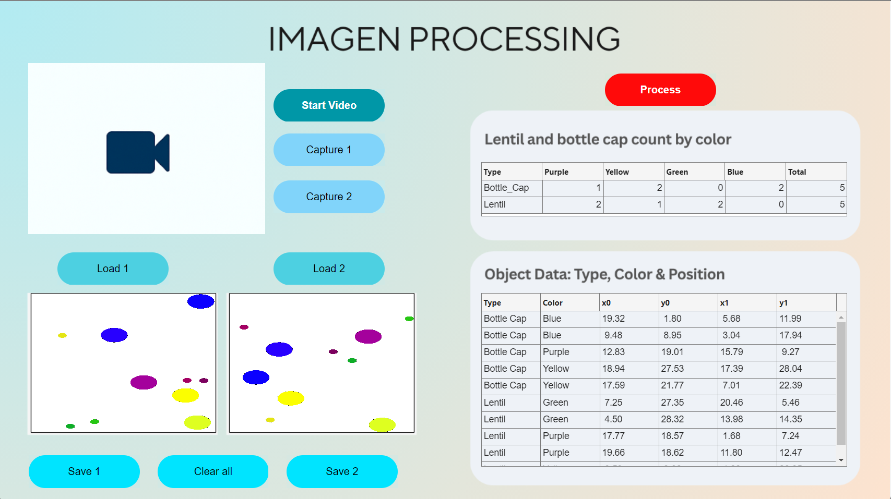

# TapsAndCandies-ImageProcessing

A **MATLAB App Designer** application for detecting, measuring, and matching plastic caps and candies (e.g. lentils) in images.  
This project processes two images (`start` and `end`), identifies detected objects, matches them based on color and type, and exports the results.

## Features

- Load images directly from file or capture with a webcam.
- Interactive GUI built in **MATLAB App Designer**.
- Automatic scale calculation using detected A4 paper as reference.
- Color segmentation and object classification (**bottle caps**, **lentils**, or **unknowns**) using custom implementations — no specialized toolbox required.
- Compute object areas and centroid positions.
- Match corresponding objects between `start` and `end` images.
- Export raw and matched detection results as CSV.
- Display a summary of object counts per color and type.

## Requirements

- MATLAB **R2025a** or later.

## Installation

```bash
git clone https://github.com/asdcainicela/TapsAndCandies-ImageProcessing.git
```

Then:

1. Open MATLAB.
2. Navigate to the project folder.
3. Run `App.mlapp` in App Designer.

## Project Structure

```
TapsAndCandies-ImageProcessing/
├── App.mlapp                    # Main App Designer file with the full GUI layout and callbacks.
├── app_exported.m               # Auto-generated exported version of the App for standalone execution.
├── config/
│   └── boton_config.csv          # CSV file defining properties of custom RoundButton UI components.
├── doc/
│   └── info/                    # Reference documents and additional information about the project.
├── functions/
│   ├── IO/                       # Functions for image I/O.
│   │   ├── cargarEscalarImagen.m  # Loads an image and scales it to match A4 reference if detected.
│   │   ├── guardarResultados.m    # Save detection results into CSV files.
│   │   ├── ...                    # Other utility scripts for file handling.
│   ├── detection/                # Functions to process images and detect objects.
│   │   ├── calcularEscalaDesdeHoja.m # Estimates scale (cm/pixel) by detecting the A4 sheet in the image.
│   │   ├── classify_shape.m        # Determines is a `Bottle Cap`, `Lentil`, or `Unknown` by its shape and size.
│   │   ├── detectarEnImagenes.m    # Main pipeline for image detection — preprocess, segment, classify.
│   │   ├── detectarObjetos.m       # Runs color segmentation and labeling of detected regions.
│   │   ├── detectarObjetosEnMascaras.m # Applies masks per color and returns detected properties.
│   │   ├── generarMascarasColor.m  # Converts image into different color masks (Yellow, Green, Blue, Purple).
│   │   ├── get_object_properties.m # Helper to extract properties like area, centroid, bounding box.
│   │   ├── my_bwlabel.m            # Custom labeling of connected components (no Toolbox dependency).
│   │   └── ...                    # Supporting image processing scripts.
│   ├── matching/                 # Functions for object matching across `start` and `end` images.
│   │   ├── calcularConteos.m       # Aggregates per-type and per-color statistics into a struct.
│   │   ├── convertirDeteccionATabla.m # Converts raw detection struct into a MATLAB table.
│   │   ├── emparejarDetecciones.m   # Matches `Bottle Cap` and `Lentil` between `start` and `end`.
│   │   └── ...                    
│   ├── preprocessing/             # Low-level image-processing utilities.
│   │   ├── manual_rgb2hsv.m        # Converts an image from RGB to HSV color space manually.
│   │   ├── my_graythresh.m         # Computes threshold manually for binarization.
│   │   ├── my_imbinarize.m         # Converts an image to binary using custom threshold.
│   │   ├── my_imcomplement.m       # Computes the complement of an image.
│   │   ├── remove_nonborder_objects.m # Cleans up objects touching the image border.
│   │   ├── remove_small_objects.m  # Removes small segmented blobs below a minimum size.
│   │   └── ...                    
│   ├── round-button/             # Custom UI RoundButton component.
│   │   ├── round_button.m         # Main class file for the RoundButton.
│   │   ├── round_button.html      # HTML used for the RoundButton's hover/pressed effects.
│   │   └── test_button.m          # Test script to verify RoundButton behavior.
│   ├── utils/                    # General utility scripts for the app.
│   │   ├── formatearDecimales.m   # Utility for formatting numeric outputs with specified decimal places.
│   │   ├── getFieldOrZero.m       # Fetch a field value from a struct or returns zero if it doesn’t exist.
│   │   └── usbwebcams.mlpkginstall # MATLAB Support Package for USB webcams.
│   └── visualize/                # Functions to visualize results.
│       └── visualizarDetecciones.m # Draws detected objects and properties over the image.
├── media/
│   ├── img-src/                  # UI images and backgrounds for AppDesigner.
│   ├── img-test/                 # Test images for `start` and `end` image sets.
├── result/                       # Generated output files:
│   ├── Counts.mat                 # MATLAB struct file containing counts per color and type.
│   ├── Matched_Detections.csv     # CSV file with the matched object properties.
│   ├── Raw_Detections.csv         # CSV file with raw detection output.
├── ss/                           # Screenshots of the app for documentation.
├── logic.m                       # Standalone demo script to run the core logic without GUI.
├── README.md                     # This file.
```

## Screenshot



## Usage

1. Run `App.mlapp`.
2. Capture or load two images (`start` and `end`).
3. Click **Process** to detect and match objects.
4. View the results directly in the app and check CSV files in `result/`.

## Notes

- Implemented without relying on `Image Processing Toolbox`.  
- Functions like binarization, thresholding, color masking, small-object removal, and boundary labeling are custom-coded for this project.

## Extending the Project

If you want to control the app via smartphone or add new features like remote capture or cloud sync, check out:

[Descarga la aplicación](https://play.google.com/store/apps/details?id=com.pas.webcam&hl=en)  
See also the example video:  
[HEBI Robotics demo](https://www.youtube.com/watch?v=zaPtxre4tFc)

## Contributing

Contributions are welcome! Feel free to fork this repo and submit pull requests.

## License

This project is distributed **without a restrictive license** — you can use, modify, and distribute it as you wish.
